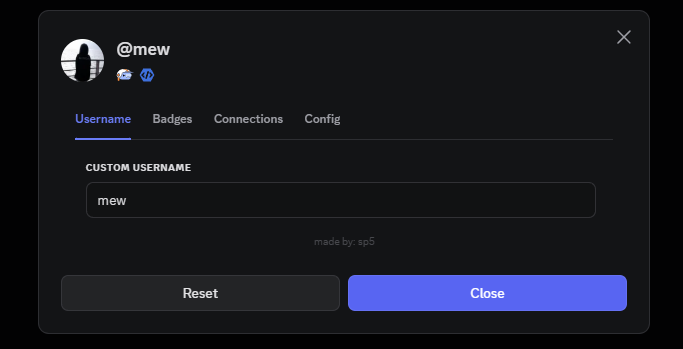
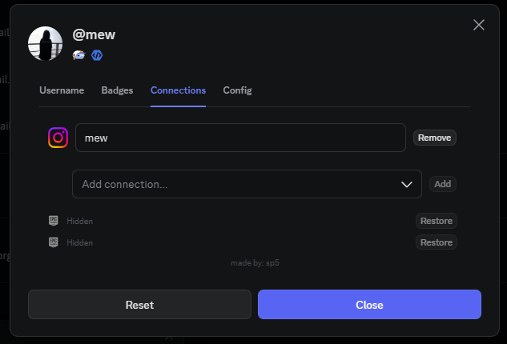

# Discord Larp Tool

A [Vencord](https://github.com/Vendicated/Vencord) userplugin that customizes how **your own** profile looks visully 

<p align="center">
  
  
</p>

## Features

- **Add badges** — show badges you don't have
- **Hide badges** — toggle off badges you actually own
- **Custom `@username`** — spoof your handle in profile, settings, and messages
- **Connections** — rename real connections, or add fake ones

## Requirements

- [Discord Desktop](https://discord.com/download) (patched with a custom Vencord build)
- [Git](https://git-scm.com/download/win)
- [Node.js](https://nodejs.org/) (includes `corepack` for pnpm)

## Quick setup

Clone this repo, then run:

```bat
auto-setup.bat
```

Restart Discord fully. Press **CTRL + B** inside of discord to open the tool

**Optional .bat setup variables:**

```bat
set DISCORD_BRANCH=stable          :: auto | stable | ptb | canary
set DISCORD_LOCATION=C:\path\to\Discord
set VENCORD_DIR=C:\path\to\Vencord
set NOINJECT=1                     :: build only, skip patching Discord
auto-setup.bat
```

## Manual setup

Follow the [Vencord custom plugins guide](https://docs.vencord.dev/installing/custom-plugins/):

1. [Build Vencord from source](https://docs.vencord.dev/installing/#building-vencord)
2. Create `src/userplugins/larp/` in your Vencord folder
3. Copy `larp/index.tsx` into that folder
4. Run `pnpm build` and patch Discord (`pnpm inject` or the installer script)
5. Restart Discord fully. Press **CTRL + B** inside of discord to open the tool

## Usage

| Tab | What it does |
|---|---|
| **Username** | Set a custom `@username` shown in the client |
| **Badges** | Search, hide owned badges, or add fake ones |
| **Connections** | Override handles, hide real links, or add fake connections |
| **Config** | Export/import your setup as JSON |

Use **Reset** in the modal to clear all overrides.

### Sharing configs

Export from the **Config** tab and share the JSON file. Example:

```json
{
  "version": 1,
  "customUsername": "coolname",
  "hiddenBadges": ["active_developer"],
  "addedBadges": ["staff", "premium_opal"],
  "connectionOverrides": {
    "github:123456": { "name": "myhandle" }
  },
  "hiddenConnections": ["instagram:789"],
  "customConnections": [
    { "id": "larp-github-1", "type": "github", "name": "myhandle" },
    { "id": "larp-domain-1", "type": "domain", "name": "example.com" }
  ]
}
```

## Project structure

```
discord-larp-plugin/
├── auto-setup.bat
├── prev.png
├── prev2.png
├── larp/
│   └── index.tsx
└── README.md
```

## Disclaimer

This plugin only changes what **you** see in your Discord client. It does not modify your account on Discord's servers. Vencord custom plugins are unofficial — see the [custom plugins docs](https://docs.vencord.dev/installing/custom-plugins/).

---

made by [sp5](https://github.com/sp5-y/discord-larp-plugin)
